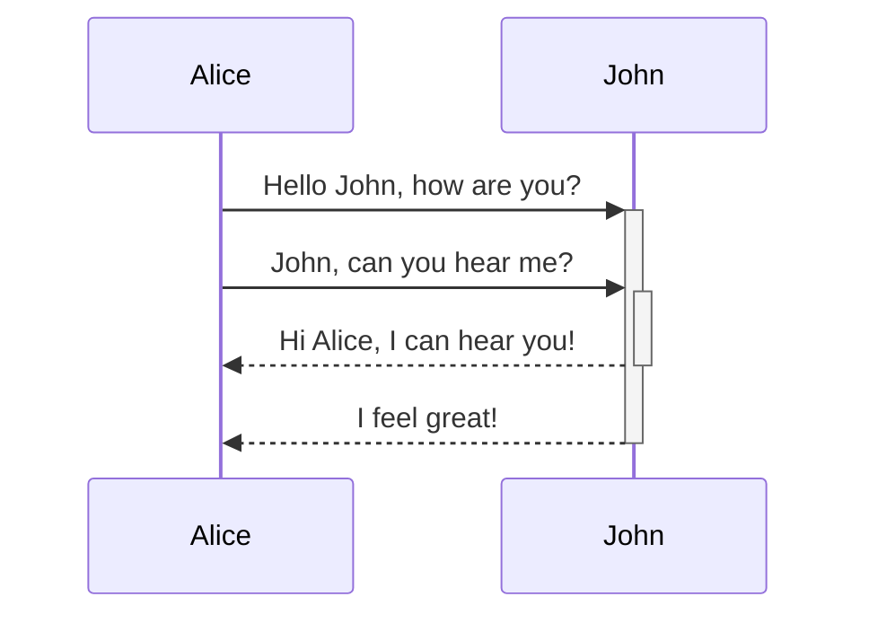
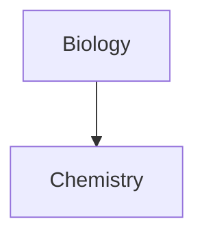

[[#Paragraphs]]
[[#Headings]]
[[#Styling text]]
[[#Quotes|Quotes]]
[[#Code]]
[[#External links]]
[[#External images]]
[[#Lists]]
[[#Horizontal bar]]
[[#Footnotes]]
[[#Comments]]
[[#Tables]]
[[#Diagram]]
[[#Math]]
# Basic formatting syntax
## Multiple blank spaces

Multiple adjacent blank spaces in and between paragraphs collapse to a single space when displaying a note in Reading view

```md
Multiple          adjacent          spaces


and multiple newlines between paragraphs.
```

If you want to add multiple spaces, you can add `&nbsp;` (blank space) and `<br>` (newline) to your note.

## Headings

```md
# This is a heading 1
## This is a heading 2
### This is a heading 3
#### This is a heading 4
##### This is a heading 5
###### This is a heading 6
```

# This is a heading .1

## This is a heading 2

### This is a heading 3

#### This is a heading 4

##### This is a heading 5

###### This is a heading 6

## Styling text
```md
Bold == **Bold** or __Bold__
Italics == *Bold* or _Bold_
Highlights == ==Highlights==
Bold and Italics == ***Bold and Italics***
```

**Bold**
*Bold*
==Highlights==
***Bold and Italics***

## Quotes

```md
> Human beings face ever more complex and urgent problems, and their effectiveness in dealing with these problems is a matter that is critical to the stability and continued progress of society.

\- Doug Engelbart, 1961
```

> Human beings face ever more complex and urgent problems, and their effectiveness in dealing with these problems is a matter that is critical to the stability and continued progress of society.
- Doug Engelbart, 1961

## Code


### Inline code

```md
Text inside `backticks` on a line will be formatted like code.
```

Text inside `backticks` on a line will be formatted like code.


### Code blocks

To format a block of code, surround the code with triple backticks.

````
``` cd ~/Desktop ```
````

```md
cd ~/Desktop
```


You can add syntax highlighting to a code block, by adding a language code after the first set of backticks.

````md
```js
function fancyAlert(arg) {
  if(arg) {
    $.facebox({div:'#foo'})
  }
}
```
````

```js
function fancyAlert(arg) {
  if(arg) {
    $.facebox({div:'#foo'})
  }
}
```

Obsidian uses Prism for syntax highlighting.

## External links

```md
[Obsidian Help](https://help.obsidian.md)
```

[Obsidian Help](https://help.obsidian.md/)


### Escape blank spaces in links

If your URL contains blank spaces, you need to escape them by replacing them with `%20`.

```md
[My Note](obsidian://open?vault=MainVault&file=My%20Note.md)
```

You can also escape the URL by wrapping it with angled brackets (`< >`).

```md
[My Note](<obsidian://open?vault=MainVault&file=My Note.md>)
```

## External images

You can add images with external URLs, by adding a `!` symbol before an [external link](https://help.obsidian.md/Editing+and+formatting/Basic+formatting+syntax#External%20links).

```md

```


You can change the image dimensions, by adding `|640x480` to the link destination, where 640 is the width and 480 is the height.

```md

```

If you only specify the width, the image scales according to its original aspect ratio. For example, `![[Engelbart.jpg|100]]`.

## Lists

You can create an unordered list by adding a `-`, `*`, or `+` before the text.

```md
- First list item
- Second list item
- Third list item
```

- First list item
- Second list item
- Third list item

To create an ordered list, start each line with a number followed by a `.` symbol.

```md
1. First list item
2. Second list item
3. Third list item
```

1. First list item
2. Second list item
3. Third list item

You can create a nested list by indenting one of more list items.

```md
1. First list item
   1. Ordered nested list item
2. Second list item
   - Unordered nested list item
```

1. First list item
    1. Ordered nested list item
2. Second list item
    - Unordered nested list item

You can press `Tab` or `Shift+Tab` to indent or unindent one of more selected list items.

### Task lists

To create a task list, start each list item with a hyphen and space followed by `[ ]`.

```md
- [x] This is a completed task.
- [ ] This is an incomplete task.
```

- [x] This is a completed task.
- [ ] This is an incomplete task.

You can toggle a task in Reading view by selecting the checkbox.

Tip

You can use any character inside the brackets to mark it as complete.

```md
- [x] Milk
- [?] Eggs
- [-] Eggs
```

- [x] Milk
- [x] Eggs
- [x] Eggs

## Horizontal bar

You can use three or more stars `***`, hypens `---`, or underscore `___` on its own line to add a horizontal bar. You can also separate symbols using spaces.

```md
***
****
* * *
---
----
- - -
___
____
_ _ _
```

---

---

## Footnotes

You can add footnotes to your notes using the following syntax:

```md
This is a simple footnote[^1].

[^1]: This is the referenced text.
[^2]: Add 2 spaces at the start of each new line.
  This lets you write footnotes that span multiple lines.
[^note]: Named footnotes still appears as numbers, but can make it easier to identify and link references.
```

You can also inline footnotes in a sentence. Note that the caret goes outside the brackets.

```md
You can also use inline footnotes. ^[This is an inline footnote.]
```

## Comments

You can add comments by wrapping text with `%%`. Comments are only visible in Editing view.

```md
This is an %%inline%% comment.

%%
This is a block comment.

Block comments can span multiple lines.
%%
```

# Advanced formatting syntax
## Tables

You can create table using vertical bars (`|`) and hyphens (`-`). Vertical bars separate columns, and hyphens define the column header.

```md
| First name | Last name |
| ---------- | --------- |
| Max        | Planck    |
| Marie      | Curie     |
```

|First name|Last name|
|---|---|
|Max|Planck|
|Marie|Curie|

The vertical bars or either side of the table are optional.

Cells don't need to be perfectly aligned with the columns. Each header row must have at least two hyphens.

```md
First name | Last name
-- | --
Max | Planck
Marie | Curie
```

### Format content within a table

You can use [[#Basic formatting syntax]] to style content within a table

If you want to use aliases, or to resize an image in your table, you need to add a `\` before the vertical bar.

```md
First column | Second column
-- | --
[[Basic formatting syntax\|Markdown syntax]] | ![[og-image.png\|200]]
```

|First column|Second column|
|---|---|
|[Markdown syntax](https://help.obsidian.md/Editing+and+formatting/Basic+formatting+syntax)||

You can align text to the left, right, or center of a column by adding colons (`:`) to the header row.

```md
Left-aligned text | Center-aligned text | Right-aligned text
:-- | :--: | --:
Content | Content | Content
```

|Left-aligned text|Center-aligned text|Right-aligned text|
|:--|:-:|--:|
|Content|Content|Content|

## Diagram

You can add diagrams and charts to your notes, using [Mermaid](https://mermaid-js.github.io/). Mermaid supports a range of diagrams, such as [flow charts](https://mermaid.js.org/syntax/flowchart.html), [sequence diagrams](https://mermaid.js.org/syntax/sequenceDiagram.html), and [timelines](https://mermaid.js.org/syntax/timeline.html).

Tip

You can also try Mermaid's [Live Editor](https://mermaid-js.github.io/mermaid-live-editor) to help you build diagrams before you include them in your notes.

To add a Mermaid diagram, create a `mermaid` [code block](https://help.obsidian.md/Editing+and+formatting/Basic+formatting+syntax#Code%20blocks).

````md

````

AliceJohnHello John, how are you?John, can you hear me?Hi Alice, I can hear you!I feel great!AliceJohn

````md

````

### Linking files in a diagram

You can create [internal links](https://help.obsidian.md/Linking+notes+and+files/Internal+links) in your diagrams by attaching the `internal-link` [class](https://mermaid.js.org/syntax/flowchart.html#classes) to your nodes.

````md

````

Note

Internal links from diagrams don't show up in the [Graph view](https://help.obsidian.md/Plugins/Graph+view).

If you have many nodes in your diagrams, you can use the following snippet.

````md

````

This way, each letter node becomes an internal link, with the [node text](https://mermaid.js.org/syntax/flowchart.html#a-node-with-text) as the link text.

Note

If you use special characters in your note names, you need to put the note name in double quotes.

```
class "⨳ special character" internal-link
```

Or, `A["⨳ special character"]`.

For more information about creating diagrams, refer to the [official Mermaid docs](https://mermaid.js.org/intro/).

## Math

You can add math expressions to your notes using [MathJax](http://docs.mathjax.org/en/latest/basic/mathjax.html) and the LaTeX notation.

To add a MathJax expression to your note, surround it with double dollar signs (`$$`).

```md
$$
\begin{vmatrix}a & b\\
c & d
\end{vmatrix}=ad-bc
$$
```

You can also inline math expressions by wrapping it in `$` symbols.

```md
This is an inline math expression $e^{2i\pi} = 1$.
```

This is an inline math expression $e^{2i\pi} = 1$.